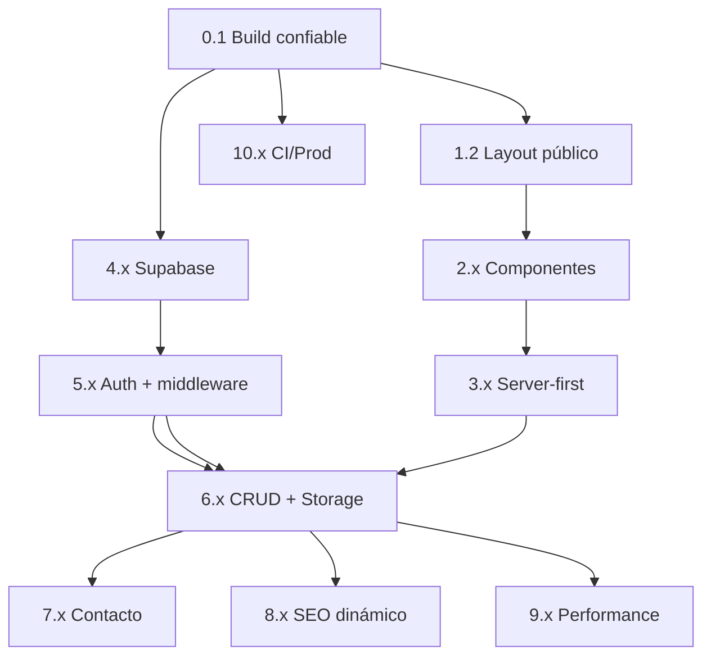

# Roadmap técnico incremental — Portfolio fotográfico productivo

Roadmap derivado del análisis del repo actual (Next.js 16, mock data, admin sin auth, Supabase ausente). Cada etapa es **pequeña, reversible y desplegable por sí sola**; el orden prioriza estabilidad antes que features.

**Convención de prioridad:** P0 (bloqueante) → P1 (alta) → P2 (media) → P3 (baja)

---

## Visión por fases (macro)

| Fase   | Nombre                                | Duración orientativa | Resultado                                   |
| ------ | ------------------------------------- | -------------------- | ------------------------------------------- |
| **0**  | Higiene y baseline                    | 1–3 días             | Build confiable, assets, sin deuda oculta   |
| **1**  | Arquitectura de carpetas y layouts    | 2–4 días             | Estructura escalable sin backend            |
| **2**  | Componentes reutilizables             | 2–3 días             | Menos duplicación, UI consistente           |
| **3**  | Server-first y datos tipados          | 2–4 días             | RSC, SEO base, capa de datos abstracta      |
| **4**  | Supabase foundation                   | 2–3 días             | DB, Storage, env, tipos                     |
| **5**  | Auth y admin seguro                   | 3–5 días             | Login real, middleware, layouts separados   |
| **6**  | Contenido dinámico (projects/gallery) | 4–6 días             | CRUD real, imágenes en Storage              |
| **7**  | Contacto y mensajes                   | 2–3 días             | Formulario persistente + admin inbox        |
| **8**  | SEO y contenido legal                 | 2–3 días             | Metadata, OG, sitemap, páginas legales      |
| **9**  | Performance y a11y                    | 2–4 días             | Imágenes optimizadas, motion, accesibilidad |
| **10** | Producción y operaciones              | 1–2 días             | CI, monitoreo, documentación                |

---

## FASE 0 — Higiene y baseline

### Etapa 0.1 — Configuración de build confiable

| Campo                  | Detalle                                                                         |
| ---------------------- | ------------------------------------------------------------------------------- |
| **Objetivo**           | Eliminar `ignoreBuildErrors`; que `next build` falle si hay errores TypeScript. |
| **Prioridad**          | P0                                                                              |
| **Riesgos**            | Pueden aparecer decenas de errores TS ocultos; resolverlos antes de seguir.     |
| **Archivos afectados** | `next.config.mjs`, posiblemente varios `.tsx` con tipos incorrectos             |
| **Dependencias**       | Ninguna nueva                                                                   |
| **Mejoras**            | CI/deploy predecible; deuda visible                                             |

---

### Etapa 0.2 — Inventario y assets mínimos

| Campo                  | Detalle                                                                                                 |
| ---------------------- | ------------------------------------------------------------------------------------------------------- |
| **Objetivo**           | Documentar imágenes requeridas; añadir placeholders reales en `public/images/` o documentar fuente CDN. |
| **Prioridad**          | P0                                                                                                      |
| **Riesgos**            | Peso del repo si se commitean RAW; preferir assets optimizados o Storage desde etapa 4.                 |
| **Archivos afectados** | `public/images/**`, `lib/projects-data.ts`, referencias en componentes home/admin                       |
| **Dependencias**       | Ninguna (assets manuales)                                                                               |
| **Mejoras**            | Sitio visualmente funcional en local y preview                                                          |

---

### Etapa 0.3 — Limpieza CSS duplicado

| Campo                  | Detalle                                                                                           |
| ---------------------- | ------------------------------------------------------------------------------------------------- |
| **Objetivo**           | Una sola fuente de tokens: conservar `app/globals.css`, eliminar o archivar `styles/globals.css`. |
| **Prioridad**          | P1                                                                                                |
| **Riesgos**            | Bajo si nada importa `styles/globals.css` (verificar imports).                                    |
| **Archivos afectados** | `styles/globals.css`, `app/globals.css`, `components.json`                                        |
| **Dependencias**       | Ninguna                                                                                           |
| **Mejoras**            | Consistencia visual; menos confusión al theming                                                   |

---

### Etapa 0.4 — Metadata y branding base

| Campo                  | Detalle                                                                                                                    |
| ---------------------- | -------------------------------------------------------------------------------------------------------------------------- |
| **Objetivo**           | Reemplazar “Luminara”/demo por datos reales de la fotógrafa; quitar `generator: 'v0.app'`; actualizar `package.json` name. |
| **Prioridad**          | P1                                                                                                                         |
| **Riesgos**            | Contenido incompleto si el cliente no entregó copy; usar variables de entorno o `site.config.ts`.                          |
| **Archivos afectados** | `app/layout.tsx`, `components/layout/header.tsx`, `footer.tsx`, `app/about/page.tsx`, admin sidebar/login                  |
| **Dependencias**       | Ninguna                                                                                                                    |
| **Mejoras**            | Identidad coherente antes de SEO profundo                                                                                  |

---

### Etapa 0.5 — Páginas de error y rutas rotas

| Campo                  | Detalle                                                                                           |
| ---------------------- | ------------------------------------------------------------------------------------------------- |
| **Objetivo**           | Añadir `app/not-found.tsx`; crear `/privacy` y `/terms` **o** quitar links del footer.            |
| **Prioridad**          | P1                                                                                                |
| **Riesgos**            | Contenido legal debe revisarse con la fotógrafa (no es solo técnico).                             |
| **Archivos afectados** | `app/not-found.tsx`, `app/privacy/page.tsx`, `app/terms/page.tsx`, `components/layout/footer.tsx` |
| **Dependencias**       | Ninguna                                                                                           |
| **Mejoras**            | UX y SEO (sin 404 silenciosos)                                                                    |

---

### Etapa 0.6 — Documentación mínima del proyecto

| Campo                  | Detalle                                                            |
| ---------------------- | ------------------------------------------------------------------ |
| **Objetivo**           | `README.md` + `.env.example` con variables futuras (sin secretos). |
| **Prioridad**          | P2                                                                 |
| **Riesgos**            | Ninguno relevante                                                  |
| **Archivos afectados** | `README.md`, `.env.example` (nuevo)                                |
| **Dependencias**       | Ninguna                                                            |
| **Mejoras**            | Onboarding y mantenibilidad                                        |

---

## FASE 1 — Arquitectura de carpetas y layouts

### Etapa 1.1 — Configuración central del sitio

| Campo                  | Detalle                                                                              |
| ---------------------- | ------------------------------------------------------------------------------------ |
| **Objetivo**           | Crear `lib/site-config.ts` (nombre, email, redes, categorías, locale).               |
| **Prioridad**          | P1                                                                                   |
| **Riesgos**            | Sobre-abstracción si el archivo crece sin disciplina; mantener solo datos estáticos. |
| **Archivos afectados** | `lib/site-config.ts` (nuevo), header, footer, contact, about                         |
| **Dependencias**       | Ninguna                                                                              |
| **Mejoras**            | Un solo lugar para datos de marca; preparación i18n/ES                               |

---

### Etapa 1.2 — Route group público `(site)`

| Campo                  | Detalle                                                                                                          |
| ---------------------- | ---------------------------------------------------------------------------------------------------------------- |
| **Objetivo**           | Mover rutas públicas a `app/(site)/` con `layout.tsx` que incluya Header + Footer + `main`.                      |
| **Prioridad**          | P1                                                                                                               |
| **Riesgos**            | Rutas rotas si no se actualizan imports/links; probar todas las URLs.                                            |
| **Archivos afectados** | `app/page.tsx` → `app/(site)/page.tsx`, `about`, `contact`, `gallery`, `projects`, nuevo `app/(site)/layout.tsx` |
| **Dependencias**       | Etapa 1.1 recomendada                                                                                            |
| **Mejoras**            | DRY; páginas más pequeñas                                                                                        |

---

### Etapa 1.3 — Route group admin `(dashboard)` vs `(auth)`

| Campo                  | Detalle                                                                                                                        |
| ---------------------- | ------------------------------------------------------------------------------------------------------------------------------ |
| **Objetivo**           | Separar `app/admin/login` en `app/(auth)/admin/login` sin sidebar; dashboard en `app/(dashboard)/admin/...` con layout actual. |
| **Prioridad**          | P0 (antes de auth real)                                                                                                        |
| **Riesgos**            | URLs pueden cambiar (`/admin/login` debe mantenerse con redirect o misma ruta vía reexport).                                   |
| **Archivos afectados** | `app/admin/layout.tsx`, `app/admin/login/page.tsx`, estructura `app/(auth)/`, `app/(dashboard)/`                               |
| **Dependencias**       | Etapa 1.2 (patrón de groups)                                                                                                   |
| **Mejoras**            | Base correcta para Supabase Auth                                                                                               |

---

### Etapa 1.4 — Eliminar Header/Footer repetidos por página

| Campo                  | Detalle                                                                          |
| ---------------------- | -------------------------------------------------------------------------------- |
| **Objetivo**           | Quitar `<Header /><Footer />` de cada page; confiar en layout `(site)`.          |
| **Prioridad**          | P1                                                                               |
| **Riesgos**            | `pt-20` en main — centralizar en layout para no duplicar offset del header fijo. |
| **Archivos afectados** | Todas las pages en `(site)/`, `components/layout/`                               |
| **Dependencias**       | Etapa 1.2                                                                        |
| **Mejoras**            | Mantenibilidad; cambios de nav en un solo archivo                                |

---

## FASE 2 — Componentes reutilizables

### Etapa 2.1 — `PageHero` unificado

| Campo                  | Detalle                                                                                            |
| ---------------------- | -------------------------------------------------------------------------------------------------- |
| **Objetivo**           | Extraer patrón label + título + descripción usado en About, Projects, Gallery, Contact.            |
| **Prioridad**          | P1                                                                                                 |
| **Riesgos**            | Regresiones visuales si no se replica spacing exacto.                                              |
| **Archivos afectados** | `components/layout/page-hero.tsx` (nuevo), pages mencionadas, posible extensión de `SectionHeader` |
| **Dependencias**       | Fase 1.2                                                                                           |
| **Mejoras**            | Consistencia visual; menos copy-paste                                                              |

---

### Etapa 2.2 — `CategoryFilter` reutilizable

| Campo                  | Detalle                                                                                     |
| ---------------------- | ------------------------------------------------------------------------------------------- |
| **Objetivo**           | Un componente para pills (gallery buttons + projects links).                                |
| **Prioridad**          | P2                                                                                          |
| **Riesgos**            | Diferencia Link vs button — soportar variante `mode: 'link' \| 'button'`.                   |
| **Archivos afectados** | `components/shared/category-filter.tsx`, `app/(site)/gallery/page.tsx`, `projects/page.tsx` |
| **Dependencias**       | `lib/site-config.ts` o `lib/projects-data.ts` para categorías                               |
| **Mejoras**            | UI consistente; a11y centralizada (`aria-pressed`)                                          |

---

### Etapa 2.3 — `ProjectCard` y grid

| Campo                  | Detalle                                                                                                                       |
| ---------------------- | ----------------------------------------------------------------------------------------------------------------------------- |
| **Objetivo**           | Unificar tarjeta de proyecto (listado, related, admin preview opcional).                                                      |
| **Prioridad**          | P1                                                                                                                            |
| **Riesgos**            | Props distintas admin vs público — separar `ProjectCard` y `ProjectRow` si hace falta.                                        |
| **Archivos afectados** | `components/projects/project-card.tsx`, `projects/page.tsx`, `projects/[id]/page.tsx`, `components/home/featured-gallery.tsx` |
| **Dependencias**       | Ninguna crítica                                                                                                               |
| **Mejoras**            | Reutilización; un solo hover/ARIA pattern                                                                                     |

---

### Etapa 2.4 — `ImageLightbox` compartido

| Campo                  | Detalle                                                                               |
| ---------------------- | ------------------------------------------------------------------------------------- |
| **Objetivo**           | Extraer lightbox duplicado en gallery y project detail.                               |
| **Prioridad**          | P1                                                                                    |
| **Riesgos**            | Client-only; mantener como island pequeño.                                            |
| **Archivos afectados** | `components/gallery/image-lightbox.tsx`, `gallery/page.tsx`, `projects/[id]/page.tsx` |
| **Dependencias**       | Ninguna                                                                               |
| **Mejoras**            | a11y (dialog, focus trap, Escape) en un solo lugar                                    |

---

### Etapa 2.5 — Formularios con primitivas shadcn

| Campo                  | Detalle                                                                                   |
| ---------------------- | ----------------------------------------------------------------------------------------- |
| **Objetivo**           | Reemplazar `<select>`/`<textarea>` nativos por `Select`, `Textarea` shadcn donde aplique. |
| **Prioridad**          | P2                                                                                        |
| **Riesgos**            | Bajo                                                                                      |
| **Archivos afectados** | `contact/page.tsx`, admin project forms, `admin/settings/page.tsx`                        |
| **Dependencias**       | Ya instalados en `components/ui/`                                                         |
| **Mejoras**            | Consistencia visual y focus states                                                        |

---

### Etapa 2.6 — Podado de UI shadcn no usado

| Campo                  | Detalle                                                                            |
| ---------------------- | ---------------------------------------------------------------------------------- |
| **Objetivo**           | Eliminar componentes `components/ui/*` no referenciados (~50 archivos).            |
| **Prioridad**          | P2                                                                                 |
| **Riesgos**            | Romper si algo importaba indirectamente; usar búsqueda de imports antes de borrar. |
| **Archivos afectados** | `components/ui/*`, `package.json` (quitar deps Radix huérfanas)                    |
| **Dependencias**       | Auditoría de imports                                                               |
| **Mejoras**            | Bundle más liviano; upgrades shadcn más simples                                    |

---

### Etapa 2.7 — Consolidar hooks duplicados

| Campo                  | Detalle                                                                                               |
| ---------------------- | ----------------------------------------------------------------------------------------------------- |
| **Objetivo**           | Una sola ubicación: `hooks/use-mobile.ts`, `hooks/use-toast.ts`; eliminar copias en `components/ui/`. |
| **Prioridad**          | P2                                                                                                    |
| **Riesgos**            | Actualizar imports en `sidebar.tsx`, `toaster.tsx`                                                    |
| **Archivos afectados** | `hooks/*`, `components/ui/use-mobile.tsx`, `components/ui/use-toast.ts`                               |
| **Dependencias**       | Etapa 2.6 parcial                                                                                     |
| **Mejoras**            | Mantenibilidad                                                                                        |

---

## FASE 3 — Server-first y capa de datos (pre-Supabase)

### Etapa 3.1 — Repositorio abstracto de proyectos

| Campo                  | Detalle                                                                                                              |
| ---------------------- | -------------------------------------------------------------------------------------------------------------------- |
| **Objetivo**           | `lib/data/projects.ts` con funciones `getProjects`, `getProjectBySlug` que hoy lean el mock; mañana llamen Supabase. |
| **Prioridad**          | P1                                                                                                                   |
| **Riesgos**            | Ninguno si la API interna es estable                                                                                 |
| **Archivos afectados** | `lib/projects-data.ts` → refactor a `lib/data/projects.ts`, imports en pages                                         |
| **Dependencias**       | Ninguna                                                                                                              |
| **Mejoras**            | Punto único de cambio al migrar DB                                                                                   |

---

### Etapa 3.2 — Páginas de listado/detalle como Server Components

| Campo                  | Detalle                                                                                               |
| ---------------------- | ----------------------------------------------------------------------------------------------------- |
| **Objetivo**           | `projects/page.tsx` y `projects/[slug]/page.tsx` como RSC; islands client solo para filtros/lightbox. |
| **Prioridad**          | P1                                                                                                    |
| **Riesgos**            | `useSearchParams` requiere Suspense — ya existe patrón en projects; extender con cuidado.             |
| **Archivos afectados** | `app/(site)/projects/page.tsx`, `[id]/page.tsx`, nuevos `*-client.tsx`                                |
| **Dependencias**       | Etapa 3.1                                                                                             |
| **Mejoras**            | HTML con contenido; mejor SEO y FCP                                                                   |

---

### Etapa 3.3 — `generateStaticParams` + `notFound` server-side

| Campo                  | Detalle                                                                       |
| ---------------------- | ----------------------------------------------------------------------------- |
| **Objetivo**           | Pre-renderizar slugs conocidos; `notFound()` desde servidor si slug inválido. |
| **Prioridad**          | P1                                                                            |
| **Riesgos**            | Con DB dinámica, combinar ISR `revalidate` en etapa 6                         |
| **Archivos afectados** | `projects/[slug]/page.tsx`                                                    |
| **Dependencias**       | Etapa 3.2                                                                     |
| **Mejoras**            | Rutas 404 correctas; CDN-friendly                                             |

---

### Etapa 3.4 — Home y About mayormente estáticos (RSC)

| Campo                  | Detalle                                                                                             |
| ---------------------- | --------------------------------------------------------------------------------------------------- |
| **Objetivo**           | Reducir `"use client"` en secciones sin interactividad; motion opcional o `prefers-reduced-motion`. |
| **Prioridad**          | P2                                                                                                  |
| **Riesgos**            | Cambio visual si se quita motion — acordar con cliente                                              |
| **Archivos afectados** | `components/home/*`, `app/(site)/page.tsx`, `about/page.tsx`                                        |
| **Dependencias**       | Etapa 1.2                                                                                           |
| **Mejoras**            | Menos JS en landing                                                                                 |

---

### Etapa 3.5 — Tipos de dominio centralizados

| Campo                  | Detalle                                                                                |
| ---------------------- | -------------------------------------------------------------------------------------- |
| **Objetivo**           | `types/project.ts`, `types/gallery.ts`, `types/message.ts` exportados desde un barrel. |
| **Prioridad**          | P2                                                                                     |
| **Riesgos**            | Bajo                                                                                   |
| **Archivos afectados** | `types/*`, `lib/data/*`                                                                |
| **Dependencias**       | Etapa 3.1                                                                              |
| **Mejoras**            | Contrato claro para Supabase types después                                             |

---

## FASE 4 — Supabase foundation

### Etapa 4.1 — Proyecto Supabase y variables de entorno

| Campo                  | Detalle                                                                                                                                     |
| ---------------------- | ------------------------------------------------------------------------------------------------------------------------------------------- |
| **Objetivo**           | Crear proyecto Supabase; documentar `NEXT_PUBLIC_SUPABASE_URL`, `NEXT_PUBLIC_SUPABASE_ANON_KEY`, `SUPABASE_SERVICE_ROLE_KEY` (solo server). |
| **Prioridad**          | P0                                                                                                                                          |
| **Riesgos**            | Filtrar service role al cliente — nunca en bundle público                                                                                   |
| **Archivos afectados** | `.env.example`, `.env.local` (local, gitignored)                                                                                            |
| **Dependencias**       | Cuenta Supabase                                                                                                                             |
| **Mejoras**            | Base para auth, DB, storage                                                                                                                 |

---

### Etapa 4.2 — Clientes Supabase (browser + server)

| Campo                  | Detalle                                                                          |
| ---------------------- | -------------------------------------------------------------------------------- |
| **Objetivo**           | `lib/supabase/client.ts`, `lib/supabase/server.ts` según patrón `@supabase/ssr`. |
| **Prioridad**          | P0                                                                               |
| **Riesgos**            | Cookies en App Router — seguir docs oficiales Next 15/16                         |
| **Archivos afectados** | `lib/supabase/*`, posible `middleware.ts` (stub)                                 |
| **Dependencias**       | `@supabase/supabase-js`, `@supabase/ssr`                                         |
| **Mejoras**            | Acceso tipado a DB desde RSC y Client                                            |

---

### Etapa 4.3 — Schema SQL inicial

| Campo                  | Detalle                                                                                                             |
| ---------------------- | ------------------------------------------------------------------------------------------------------------------- |
| **Objetivo**           | Tablas: `projects`, `project_images`, `gallery_images` (opcional), `contact_messages`, `site_settings`, `profiles`. |
| **Prioridad**          | P0                                                                                                                  |
| **Riesgos**            | Diseño incorrecto de categorías — usar `text` + check o tabla `categories`                                          |
| **Archivos afectados** | `supabase/migrations/001_initial.sql` (nuevo)                                                                       |
| **Dependencias**       | Supabase CLI opcional                                                                                               |
| **Mejoras**            | Fuente de verdad persistente                                                                                        |

---

### Etapa 4.4 — Row Level Security (RLS)

| Campo                  | Detalle                                                                                                                                     |
| ---------------------- | ------------------------------------------------------------------------------------------------------------------------------------------- |
| **Objetivo**           | Público: `SELECT` en `published = true`; autenticado (admin): CRUD en tablas de contenido; mensajes: `INSERT` anónimo, `SELECT` solo admin. |
| **Prioridad**          | P0                                                                                                                                          |
| **Riesgos**            | Políticas mal configuradas = fuga de datos o bloqueo total — probar con usuarios de prueba                                                  |
| **Archivos afectados** | `supabase/migrations/002_rls.sql`                                                                                                           |
| **Dependencias**       | Etapa 4.3                                                                                                                                   |
| **Mejoras**            | Seguridad en DB, no solo en frontend                                                                                                        |

---

### Etapa 4.5 — Storage bucket para imágenes

| Campo                  | Detalle                                                                                  |
| ---------------------- | ---------------------------------------------------------------------------------------- |
| **Objetivo**           | Bucket `portfolio` (público read o signed URLs); políticas upload solo `authenticated`.  |
| **Prioridad**          | P0                                                                                       |
| **Riesgos**            | Bucket público expone URLs si se adivinan paths — considerar paths no adivinables (UUID) |
| **Archivos afectados** | migración storage policies                                                               |
| **Dependencias**       | Etapa 4.4                                                                                |
| **Mejoras**            | Base para upload real                                                                    |

---

### Etapa 4.6 — Tipos TypeScript generados

| Campo                  | Detalle                                                  |
| ---------------------- | -------------------------------------------------------- |
| **Objetivo**           | `types/database.ts` via `supabase gen types typescript`. |
| **Prioridad**          | P1                                                       |
| **Riesgos**            | Regenerar tras cada migración                            |
| **Archivos afectados** | `types/database.ts`, `lib/supabase/*`                    |
| **Dependencias**       | Supabase CLI                                             |
| **Mejoras**            | Tipado end-to-end                                        |

---

### Etapa 4.7 — Seed de datos desde mock actual

| Campo                  | Detalle                                                                         |
| ---------------------- | ------------------------------------------------------------------------------- |
| **Objetivo**           | Script o SQL seed con los 6 proyectos demo + URLs de Storage tras subir assets. |
| **Prioridad**          | P2                                                                              |
| **Riesgos**            | URLs rotas si assets no están subidos                                           |
| **Archivos afectados** | `supabase/seed.sql`, `lib/projects-data.ts` (deprecar gradualmente)             |
| **Dependencias**       | 4.3, 4.5, assets                                                                |
| **Mejoras**            | Paridad visual pre/post migración                                               |

---

## FASE 5 — Autenticación y admin seguro

### Etapa 5.1 — Supabase Auth (email/password o magic link)

| Campo                  | Detalle                                                                                   |
| ---------------------- | ----------------------------------------------------------------------------------------- |
| **Objetivo**           | Un usuario admin (fotógrafa); registro deshabilitado o invite-only en dashboard Supabase. |
| **Prioridad**          | P0                                                                                        |
| **Riesgos**            | Contraseñas débiles — política en Supabase; recuperación de contraseña                    |
| **Archivos afectados** | `app/(auth)/admin/login/page.tsx`                                                         |
| **Dependencias**       | Fase 4.2, 1.3                                                                             |
| **Mejoras**            | Login real                                                                                |

---

### Etapa 5.2 — Middleware de sesión

| Campo                  | Detalle                                                                                         |
| ---------------------- | ----------------------------------------------------------------------------------------------- |
| **Objetivo**           | `middleware.ts`: refresh cookie; proteger `/admin/*` excepto login; redirect si no autenticado. |
| **Prioridad**          | P0                                                                                              |
| **Riesgos**            | Matcher incorrecto puede bloquear assets o API; probar rutas públicas                           |
| **Archivos afectados** | `middleware.ts`, `lib/supabase/middleware.ts`                                                   |
| **Dependencias**       | `@supabase/ssr`, etapa 5.1                                                                      |
| **Mejoras**            | Panel no accesible sin sesión                                                                   |

---

### Etapa 5.3 — Logout y sesión en sidebar

| Campo                  | Detalle                                                                   |
| ---------------------- | ------------------------------------------------------------------------- |
| **Objetivo**           | `signOut()` en lugar de link a `/`; mostrar email real desde `getUser()`. |
| **Prioridad**          | P1                                                                        |
| **Riesgos**            | Bajo                                                                      |
| **Archivos afectados** | `components/admin/sidebar.tsx`                                            |
| **Dependencias**       | 5.1, 5.2                                                                  |
| **Mejoras**            | Ciclo de sesión completo                                                  |

---

### Etapa 5.4 — Corregir sidebar admin (desktop/mobile)

| Campo                  | Detalle                                                   |
| ---------------------- | --------------------------------------------------------- |
| **Objetivo**           | Animación Framer solo en `< lg`; desktop siempre visible. |
| **Prioridad**          | P1                                                        |
| **Riesgos**            | Regresión visual móvil                                    |
| **Archivos afectados** | `components/admin/sidebar.tsx`                            |
| **Dependencias**       | Ninguna crítica                                           |
| **Mejoras**            | Admin usable en todos los breakpoints                     |

---

### Etapa 5.5 — Simplificar settings “Security” mock

| Campo                  | Detalle                                                                                         |
| ---------------------- | ----------------------------------------------------------------------------------------------- |
| **Objetivo**           | Quitar 2FA fake; enlazar a flujo Supabase (cambio password, MFA nativo si se habilita después). |
| **Prioridad**          | P2                                                                                              |
| **Riesgos**            | Expectativas del cliente sobre 2FA                                                              |
| **Archivos afectados** | `app/(dashboard)/admin/settings/page.tsx`                                                       |
| **Dependencias**       | 5.1                                                                                             |
| **Mejoras**            | UI honesta; menos deuda                                                                         |

---

## FASE 6 — Contenido dinámico (projects + gallery)

### Etapa 6.1 — Lectura pública desde Supabase

| Campo                  | Detalle                                                                                   |
| ---------------------- | ----------------------------------------------------------------------------------------- |
| **Objetivo**           | `lib/data/projects.ts` usa `createServerClient`; eliminar dependencia del array estático. |
| **Prioridad**          | P0                                                                                        |
| **Riesgos**            | Latencia DB — cache con `unstable_cache` o ISR                                            |
| **Archivos afectados** | `lib/data/projects.ts`, pages projects, home featured                                     |
| **Dependencias**       | Fase 4 completa, 3.1                                                                      |
| **Mejoras**            | Contenido editable sin redeploy                                                           |

---

### Etapa 6.2 — `next.config` imágenes remotas

| Campo                  | Detalle                                                                   |
| ---------------------- | ------------------------------------------------------------------------- |
| **Objetivo**           | Quitar `unoptimized: true`; `images.remotePatterns` para `*.supabase.co`. |
| **Prioridad**          | P0                                                                        |
| **Riesgos**            | Dominio incorrecto en patterns = imágenes rotas                           |
| **Archivos afectados** | `next.config.mjs`                                                         |
| **Dependencias**       | Storage URLs reales                                                       |
| **Mejoras**            | WebP/AVIF, sizes responsive                                               |

---

### Etapa 6.3 — Admin: listar/crear/editar proyectos (Server Actions)

| Campo                  | Detalle                                                        |
| ---------------------- | -------------------------------------------------------------- |
| **Objetivo**           | CRUD en `admin/projects`, `new`, `[id]` persistiendo en DB.    |
| **Prioridad**          | P0                                                             |
| **Riesgos**            | Validación insuficiente — usar zod en actions                  |
| **Archivos afectados** | `app/(dashboard)/admin/projects/**`, `lib/actions/projects.ts` |
| **Dependencias**       | `zod`, 4.4, 5.2                                                |
| **Mejoras**            | Gestión real del portfolio                                     |

---

### Etapa 6.4 — Upload de imágenes (cover + galería por proyecto)

| Campo                  | Detalle                                                                           |
| ---------------------- | --------------------------------------------------------------------------------- |
| **Objetivo**           | Subida a Storage + filas en `project_images`; preview en form admin.              |
| **Prioridad**          | P0                                                                                |
| **Riesgos**            | Archivos grandes — límite tamaño, compresión client-side opcional                 |
| **Archivos afectados** | `admin/projects/new`, `[id]`, `lib/actions/upload.ts`, componente `ImageUploader` |
| **Dependencias**       | 4.5, 6.3                                                                          |
| **Mejoras**            | Flujo profesional de entrega de fotos                                             |

---

### Etapa 6.5 — Galería pública unificada con DB

| Campo                  | Detalle                                                                                                               |
| ---------------------- | --------------------------------------------------------------------------------------------------------------------- |
| **Objetivo**           | Una tabla/vista: imágenes de proyectos publicados **o** `gallery_images`; eliminar array local en `gallery/page.tsx`. |
| **Prioridad**          | P1                                                                                                                    |
| **Riesgos**            | Volumen alto sin paginación — cursor o infinite scroll en etapa 9                                                     |
| **Archivos afectados** | `gallery/page.tsx`, `lib/data/gallery.ts`, `admin/gallery/page.tsx`                                                   |
| **Dependencias**       | 6.1, 6.4                                                                                                              |
| **Mejoras**            | Una fuente de verdad; admin gallery sincronizado                                                                      |

---

### Etapa 6.6 — Revalidación on-demand

| Campo                  | Detalle                                                                |
| ---------------------- | ---------------------------------------------------------------------- |
| **Objetivo**           | Tras guardar en admin, `revalidatePath('/')`, `/projects`, `/gallery`. |
| **Prioridad**          | P1                                                                     |
| **Riesgos**            | Olvidar revalidar = contenido stale                                    |
| **Archivos afectados** | `lib/actions/*`                                                        |
| **Dependencias**       | 6.3                                                                    |
| **Mejoras**            | Cambios visibles sin rebuild                                           |

---

### Etapa 6.7 — Dashboard stats reales

| Campo                  | Detalle                                                                                |
| ---------------------- | -------------------------------------------------------------------------------------- |
| **Objetivo**           | Conteos desde DB (proyectos, imágenes, mensajes no leídos); quitar números inventados. |
| **Prioridad**          | P2                                                                                     |
| **Riesgos**            | “Site views” requiere analytics externo (Vercel ya parcial)                            |
| **Archivos afectados** | `app/(dashboard)/admin/page.tsx`                                                       |
| **Dependencias**       | 6.1, fase 7                                                                            |
| **Mejoras**            | Panel útil para la fotógrafa                                                           |

---

## FASE 7 — Contacto y mensajes

### Etapa 7.1 — Server Action para formulario de contacto

| Campo                  | Detalle                                                            |
| ---------------------- | ------------------------------------------------------------------ |
| **Objetivo**           | Insert en `contact_messages` + validación zod + rate limit básico. |
| **Prioridad**          | P0                                                                 |
| **Riesgos**            | Spam — honeypot, Turnstile opcional en etapa 10                    |
| **Archivos afectados** | `contact/page.tsx`, `lib/actions/contact.ts`                       |
| **Dependencias**       | 4.3, 4.4, `zod`                                                    |
| **Mejoras**            | Leads reales persistidos                                           |

---

### Etapa 7.2 — Admin messages inbox

| Campo                  | Detalle                                           |
| ---------------------- | ------------------------------------------------- |
| **Objetivo**           | `admin/messages` lee DB; marcar leído; eliminar.  |
| **Prioridad**          | P1                                                |
| **Riesgos**            | Bajo                                              |
| **Archivos afectados** | `admin/messages/page.tsx`, `lib/data/messages.ts` |
| **Dependencias**       | 7.1                                               |
| **Mejoras**            | Flujo comercial completo                          |

---

### Etapa 7.3 — Notificación por email (opcional)

| Campo                  | Detalle                               |
| ---------------------- | ------------------------------------- |
| **Objetivo**           | Resend/SMTP al recibir mensaje nuevo. |
| **Prioridad**          | P2                                    |
| **Riesgos**            | Deliverability, costos, secrets       |
| **Archivos afectados** | `lib/email/*`, action contact         |
| **Dependencias**       | `resend` o similar                    |
| **Mejoras**            | Respuesta rápida de la fotógrafa      |

---

### Etapa 7.4 — Site settings en DB

| Campo                  | Detalle                                                                                          |
| ---------------------- | ------------------------------------------------------------------------------------------------ |
| **Objetivo**           | Profile, contacto, redes desde `site_settings`; admin settings persiste.                         |
| **Prioridad**          | P1                                                                                               |
| **Riesgos**            | Cache de settings en layout — revalidar al guardar                                               |
| **Archivos afectados** | `admin/settings/page.tsx`, `lib/site-config.ts` (leer de DB con fallback), header/footer/contact |
| **Dependencias**       | 4.3, 6.6                                                                                         |
| **Mejoras**            | CMS ligero sin redeploy                                                                          |

---

## FASE 8 — SEO optimizado

### Etapa 8.1 — Metadata por ruta

| Campo                  | Detalle                                                                            |
| ---------------------- | ---------------------------------------------------------------------------------- |
| **Objetivo**           | `export const metadata` o `generateMetadata` en about, contact, gallery, projects. |
| **Prioridad**          | P1                                                                                 |
| **Riesgos**            | Títulos duplicados — template en root layout                                       |
| **Archivos afectados** | Cada `app/(site)/**/page.tsx`, `app/layout.tsx`                                    |
| **Dependencias**       | Fase 1                                                                             |
| **Mejoras**            | SERP por página                                                                    |

---

### Etapa 8.2 — Metadata dinámica por proyecto

| Campo                  | Detalle                                                                    |
| ---------------------- | -------------------------------------------------------------------------- |
| **Objetivo**           | `generateMetadata` en `[slug]` con title, description, `openGraph.images`. |
| **Prioridad**          | P0                                                                         |
| **Riesgos**            | Imagen OG debe ser URL absoluta                                            |
| **Archivos afectados** | `projects/[slug]/page.tsx`                                                 |
| **Dependencias**       | 6.1, 6.2                                                                   |
| **Mejoras**            | Compartir proyectos en redes                                               |

---

### Etapa 8.3 — `sitemap.ts` y `robots.ts`

| Campo                  | Detalle                                                                 |
| ---------------------- | ----------------------------------------------------------------------- |
| **Objetivo**           | Sitemap dinámico con proyectos publicados; robots allow/disallow admin. |
| **Prioridad**          | P1                                                                      |
| **Riesgos**            | Indexar `/admin` si robots mal configurado                              |
| **Archivos afectados** | `app/sitemap.ts`, `app/robots.ts`                                       |
| **Dependencias**       | 6.1                                                                     |
| **Mejoras**            | Indexación controlada                                                   |

---

### Etapa 8.4 — JSON-LD structured data

| Campo                  | Detalle                                                                         |
| ---------------------- | ------------------------------------------------------------------------------- |
| **Objetivo**           | `Person`/`ProfessionalService` en home; `ImageGallery` o `Article` en proyecto. |
| **Prioridad**          | P2                                                                              |
| **Riesgos**            | Datos incorrectos penalizan — solo datos reales                                 |
| **Archivos afectados** | `components/seo/json-ld.tsx`, layouts/pages                                     |
| **Dependencias**       | 0.4, 7.4                                                                        |
| **Mejoras**            | Rich results potenciales                                                        |

---

### Etapa 8.5 — Locale y `lang`

| Campo                  | Detalle                                                                        |
| ---------------------- | ------------------------------------------------------------------------------ |
| **Objetivo**           | `lang="es"` (o `es-AR`) si el mercado es hispanohablante; metadata en español. |
| **Prioridad**          | P1                                                                             |
| **Riesgos**            | Contenido mixto EN/ES durante transición                                       |
| **Archivos afectados** | `app/layout.tsx`, copy en pages                                                |
| **Dependencias**       | 0.4                                                                            |
| **Mejoras**            | SEO local y accesibilidad                                                      |

---

## FASE 9 — Performance y accesibilidad

### Etapa 9.1 — Estrategia de imágenes

| Campo                  | Detalle                                                                                         |
| ---------------------- | ----------------------------------------------------------------------------------------------- |
| **Objetivo**           | `sizes` correctos; `priority` solo hero; blur placeholders desde Storage transform o thumb URL. |
| **Prioridad**          | P1                                                                                              |
| **Riesgos**            | Costo de transforms Supabase                                                                    |
| **Archivos afectados** | Componentes con `Image`, upload pipeline                                                        |
| **Dependencias**       | 6.2                                                                                             |
| **Mejoras**            | LCP en portfolio                                                                                |

---

### Etapa 9.2 — Reducir Framer Motion

| Campo                  | Detalle                                                                                |
| ---------------------- | -------------------------------------------------------------------------------------- |
| **Objetivo**           | CSS transitions en header/footer; `useReducedMotion`; lazy `motion` solo donde aporte. |
| **Prioridad**          | P2                                                                                     |
| **Riesgos**            | Cambio estético — validar con cliente                                                  |
| **Archivos afectados** | `components/layout/*`, `components/home/*`, pages                                      |
| **Dependencias**       | 3.4                                                                                    |
| **Mejoras**            | Bundle y hidratación menores                                                           |

---

### Etapa 9.3 — Paginación / infinite scroll en galería

| Campo                  | Detalle                                               |
| ---------------------- | ----------------------------------------------------- |
| **Objetivo**           | No cargar 500 imágenes a la vez; paginar en servidor. |
| **Prioridad**          | P2                                                    |
| **Riesgos**            | SEO de galería paginada — canonical y metadata        |
| **Archivos afectados** | `gallery/page.tsx`, `lib/data/gallery.ts`             |
| **Dependencias**       | 6.5                                                   |
| **Mejoras**            | Escalabilidad                                         |

---

### Etapa 9.4 — Accesibilidad lightbox y navegación

| Campo                  | Detalle                                                                |
| ---------------------- | ---------------------------------------------------------------------- |
| **Objetivo**           | Completar Etapa 2.4: focus trap, Escape, `aria-modal`, reduced motion. |
| **Prioridad**          | P1                                                                     |
| **Riesgos**            | Bajo                                                                   |
| **Archivos afectados** | `image-lightbox.tsx`, `header.tsx`, `category-filter.tsx`              |
| **Dependencias**       | 2.4                                                                    |
| **Mejoras**            | WCAG AA parcial                                                        |

---

### Etapa 9.5 — Podar dependencias muertas

| Campo                  | Detalle                                                                                         |
| ---------------------- | ----------------------------------------------------------------------------------------------- |
| **Objetivo**           | Quitar `recharts`, deps Radix huérfanas, `react-hook-form` si no se usa (o adoptarlo en forms). |
| **Prioridad**          | P2                                                                                              |
| **Riesgos**            | Romper si quedó import oculto                                                                   |
| **Archivos afectados** | `package.json`                                                                                  |
| **Dependencias**       | 2.6, forms con zod en actions                                                                   |
| **Mejoras**            | Installs más rápidos                                                                            |

---

## FASE 10 — Producción y operaciones

### Etapa 10.1 — ESLint + TypeScript en CI

| Campo                  | Detalle                                                 |
| ---------------------- | ------------------------------------------------------- |
| **Objetivo**           | `eslint.config`, GitHub Action: `lint` + `build` en PR. |
| **Prioridad**          | P1                                                      |
| **Riesgos**            | PRs bloqueados hasta limpiar deuda                      |
| **Archivos afectados** | `eslint.config.mjs`, `.github/workflows/ci.yml`         |
| **Dependencias**       | 0.1                                                     |
| **Mejoras**            | Regresiones detectadas temprano                         |

---

### Etapa 10.2 — Variables en Vercel + preview

| Campo                  | Detalle                                               |
| ---------------------- | ----------------------------------------------------- |
| **Objetivo**           | Env prod/preview; proyecto Supabase staging opcional. |
| **Prioridad**          | P1                                                    |
| **Riesgos**            | Mezclar prod/staging DB                               |
| **Archivos afectados** | Dashboard Vercel (no repo)                            |
| **Dependencias**       | Fase 4                                                |
| **Mejoras**            | Deploys seguros                                       |

---

### Etapa 10.3 — Monitoreo y analytics

| Campo                  | Detalle                                                                              |
| ---------------------- | ------------------------------------------------------------------------------------ |
| **Objetivo**           | Mantener Vercel Analytics; opcional Sentry; vistas en dashboard desde analytics API. |
| **Prioridad**          | P3                                                                                   |
| **Riesgos**            | Privacidad GDPR si hay EU visitors                                                   |
| **Archivos afectados** | `app/layout.tsx`, admin dashboard                                                    |
| **Dependencias**       | Ninguna crítica                                                                      |
| **Mejoras**            | Operación profesional                                                                |

---

### Etapa 10.4 — Backup y migraciones documentadas

| Campo                  | Detalle                                                      |
| ---------------------- | ------------------------------------------------------------ |
| **Objetivo**           | Proceso de backup Supabase; cómo correr migraciones en prod. |
| **Prioridad**          | P2                                                           |
| **Riesgos**            | Pérdida de fotos si no hay backup Storage                    |
| **Archivos afectados** | `README.md`, `supabase/README.md`                            |
| **Dependencias**       | Fase 4                                                       |
| **Mejoras**            | Continuidad del negocio                                      |

---

## Grafo de dependencias críticas

**Regla de oro:** no iniciar Fase 6 hasta tener **0.1 + 1.3 + 4.4 + 5.2**. No subir a producción sin **5.2 + 6.2 + 8.3**.

---

## Orden sugerido por sprints (2 semanas c/u)

| Sprint | Etapas             | Entregable demo-able                     |
| ------ | ------------------ | ---------------------------------------- |
| **S1** | 0.1–0.5, 1.1–1.4   | Sitio estable, layouts, sin 404 legales  |
| **S2** | 2.1–2.5, 3.1–3.3   | Menos duplicación, projects en RSC       |
| **S3** | 4.1–4.6, 5.1–5.4   | Supabase + login + admin protegido       |
| **S4** | 6.1–6.6, 6.2       | Portfolio editable + imágenes en Storage |
| **S5** | 7.1–7.4, 8.1–8.5   | Contacto real, SEO, settings CMS         |
| **S6** | 2.6–2.7, 9.x, 10.x | Pulido performance, CI, prod             |

---

## Criterios de “listo para producción” (checklist)

- [ ] `next build` sin `ignoreBuildErrors`
- [ ] `/admin/*` protegido por middleware + RLS
- [ ] Imágenes en Supabase Storage con URLs en DB
- [ ] Sin datos mock en rutas públicas
- [ ] `generateMetadata` en proyectos
- [ ] `sitemap.xml` + `robots.txt`
- [ ] Formulario contacto persiste + admin inbox
- [ ] Privacy/Terms publicados
- [ ] Imágenes optimizadas (`unoptimized: false`)
- [ ] README + `.env.example` + CI green

---

## Qué NO hacer hasta más adelante (evitar scope creep)

| Tema                          | Por qué esperar                                 |
| ----------------------------- | ----------------------------------------------- |
| Multi-usuario / roles         | Una fotógrafa = un admin basta                  |
| i18n completo (next-intl)     | Primero ES fijo; i18n en P3 si hace falta       |
| Blog                          | Fuera del MVP portfolio                         |
| E-commerce / bookings         | Integrar Calendly link antes que booking engine |
| PWA offline                   | Bajo ROI para portfolio                         |
| Reemplazar shadcn por otro DS | Costo alto, beneficio bajo                      |

---

Este roadmap es solo planificación; no implica cambios en el repo. Cuando quieras ejecutar, activá **Agent mode** y podemos arrancar por **Sprint 1 (Fase 0 + 1)** con commits pequeños por etapa.
